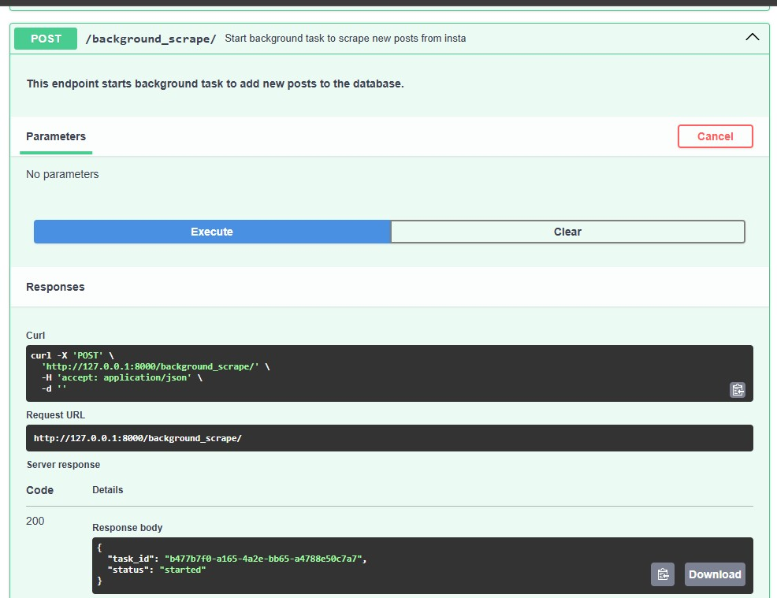

## Scraping Instagram

This project is a Python scraper from Instagram account that does the following: 
* Gets a list of the last 10 posts from a public Instagram account (e.g. @nasa account). 
* Parses information about each post: e.g. description, number of likes, number of comments. 
* Checks for the presence of a certain hashtag (e.g. #Space). 
* Saves the data to a DB. 
* Outputs the results in JSON format via API (FastAPI Framework). 
* Automatically checks for new posts in the selected account every 10 minutes (implemented via Celery + Redis) 
* Telegram bot sends messages when  the posts  with a given hashtag appears

## Features:
### API to manage posts & tasks.


  **Endpoints:** 
   * ```GET /posts/``` - Get paginated list of posts with possibility to filter by ```ID``` or partial ```URL```


   * ```POST /add_post/``` - Add post manually


   * ```POST /scrape/``` - Scrape all new posts manually (starts "hard" scraping task - not recommended)


   * ```POST /background_scrape/``` - Scrape all new posts in background mode (**Recommended**)


   * ```GET /task_status/{task_id}/``` - Check task status & list of new posts as Result

### Scraping

  * Used Selenium & BeautifulSoup for Logging & Parsing all new posts from defined account 
 
  It is strongly recommended to use proxy to avoid ip blocking when there is a large flow of requests.


 * Scraping task starts every 10 min using Celery/Redis. 
  It analyzes the latest 10 posts to find the new and to save it in db.

### Notifications 

 * Telegram Bot informs about the new posts with defined Hashtag.

### Docker & Docker Compose 

Applications are deployed in docker containers:
- fastapi-selenium apps
- celery worker for scraping
- celery beat for periodic tasks
- flower tasks monitoring
- redis as broker & backend

___
## Tech Stack & System requirements :

* Python 3.12
* FastAPI
* SqlAlchemy orm
* SQlite Database
* Selenium
* BeautifulSoup
* TelegramBotAPI
* Celery
* Redis (used as a Broker & Backend)
* Flower (monitoring for Celery)
* Docker Containerization

---

### Run with Docker containers
 System requirements:

* **Docker Engine** (Docker Desktop 4.+) / **Docker Compose** 

Run project:
```
docker-compose up --build
```

#### API documentation - Post & Tasks management
   - [https://127.0.0.1:8000/docs](https://127.0.0.1:8000/docs)

Please note:
   * Copy [.env-sample](.env.sample) file to **.env** & set environment variables
   * Set ```TARGET_NAME``` and ```HASHTAG```  for specific account & hashtag in [scrape/tags_settings.py](scrape/tags_settings.py)


#### Tasks monitoring - Access Flower / Celery tasks monitoring
   - [http://127.0.0.1:5555/tasks/](http://127.0.0.1:8000/5555/tasks/)

### Demo





### Contact
Feel free to contact: u123@ua.fm
